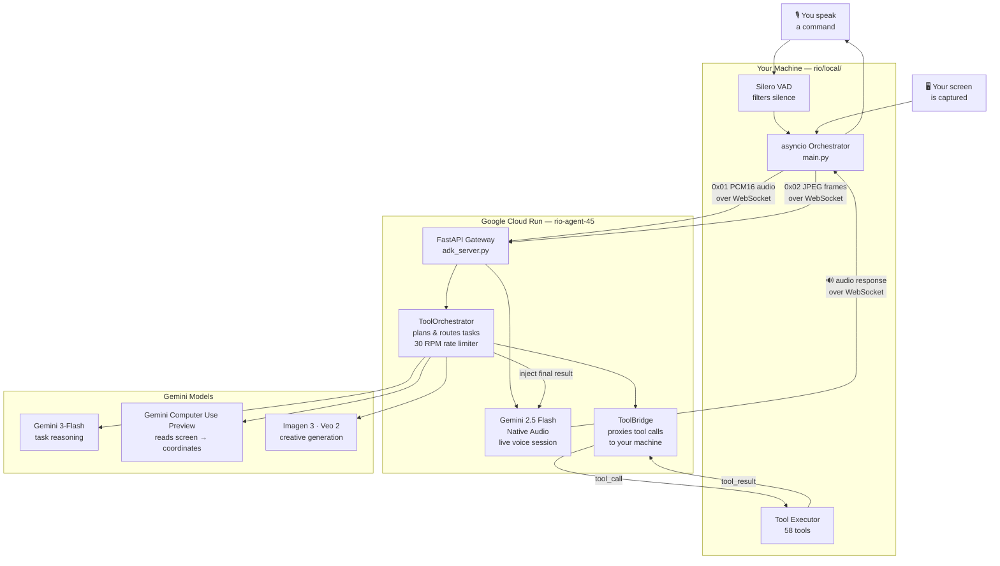
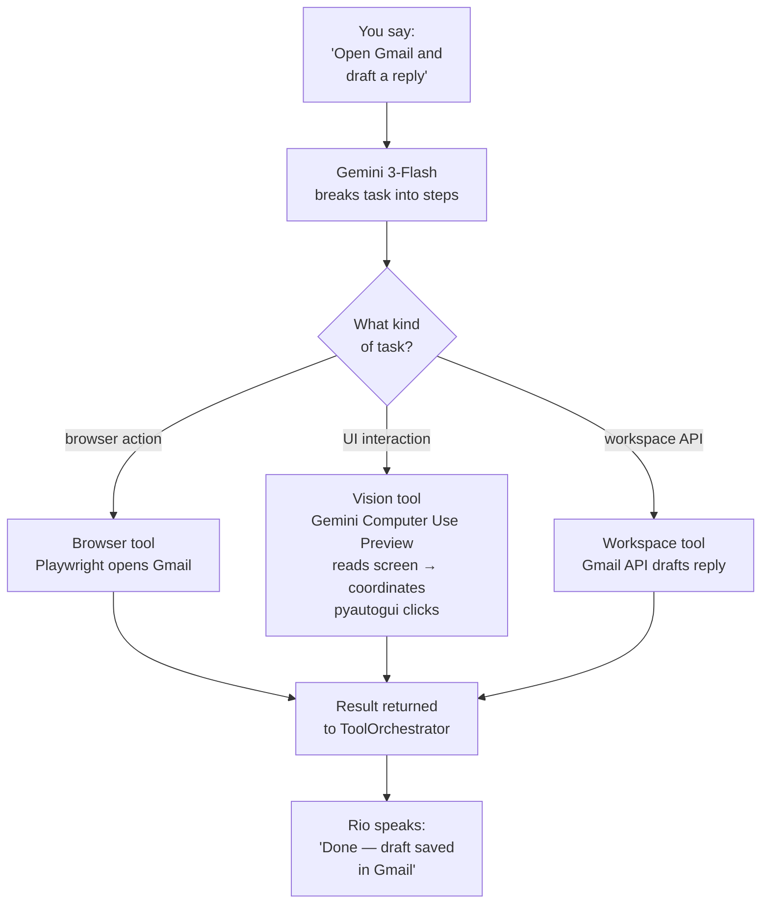

# Rio Agent

[](https://python.org)
[](https://cloud.google.com/run)
[](https://ai.google.dev)
[](https://google.github.io/adk-docs/)
[](https://fastapi.tiangolo.com)

> **One command. Full autonomy.**  
> Rio listens, sees your screen, plans, acts, and reports — without requiring a single click from you.

---

## The Problem

Every AI assistant today is still a text box with better autocomplete. You remain the orchestrator: restating context after every turn, approving micro-steps, and manually bridging the gap between what you said and what needs to happen on screen. For real multi-step tasks — "draft the emails, attach the report, schedule the follow-up" — that model completely breaks.

## The Solution

Rio replaces the turn-by-turn loop with a **continuous multimodal control lane**. The local runtime streams your voice and live screen state to a cloud agent that plans, calls tools, confirms on-screen outcomes via OCR, and speaks the result back — all in one uninterrupted flow. You give one command. Rio closes the task.

---

## Challenge Categories

| Track | Status |
|---|---|
| ✅ Live Agent | Full — voice I/O, barge-in, persona, live bidirectional streaming |
| ✅ UI Navigator | Full — OCR-grounded screen understanding, Playwright browser control, post-action verification |
| 🔄 Storyteller / Creative Agent | Partial — Imagen 3 + Veo 2 generation works; narrative packaging in progress |

---

## Architecture

### System Overview



### Tool Execution Flow



> **Key design decision:** `RIO_LIVE_MODEL_TOOLS=false` by default. All tool execution routes through the text orchestrator, not the native audio model — this prevents unreliable function-calling in live audio sessions while keeping voice I/O seamless.

---

## Multimodal Experience

### Beyond the Text Box
Rio has no chat input field. Interaction is entirely voice-in / voice-out, with screen vision as passive ground truth.

| Criterion | How Rio Satisfies It | Evidence in Code |
|---|---|---|
| **Voice + Vision loop** | Mic + screenshot stream run as parallel asyncio loops; neither blocks the other | `local/main.py` — `audio_capture_loop` + `screen_capture_loop` |
| **Barge-in / interruption** | F2 PTT clears active playback immediately; VAD speech-start also interrupts | `local/push_to_talk.py`, `local/audio_io.py` playback cancel path |
| **Distinct persona / voice** | Agent name, role, and voice ID are config-driven (`RIO_VOICE`, `RIO_AGENT_NAME`) | `cloud/gemini_session.py` `_build_role_intro()`, `cloud/voice_plugin.py` |
| **Visual precision** | OCR extracts on-screen text before + after every action; `smart_click` sends the screenshot to **Gemini Computer Use Preview** which returns pixel coordinates — pyautogui then executes the physical click | `local/tools.py` `smart_click()`, `local/ocr.py` |
| **Live, not turn-based** | Bidirectional WebSocket + background orchestrator task with `inject_context()` keeps the voice session alive while tools execute | `cloud/adk_server.py` `inject_context()`, `cloud/tool_orchestrator.py` |

---

## Technical Implementation

### Vision-Guided UI Control — Gemini Computer Use Preview

Rio uses **Gemini Computer Use Preview** (`gemini-3-flash-preview` with computer use capability) as the vision intelligence layer for all UI interactions.

The pipeline works in two stages:

```
Screenshot (JPEG)
      │
      ▼
Gemini Computer Use Preview
  → reads screen context
  → identifies target element
  → returns normalized (x, y) coordinates
      │
      ▼
pyautogui
  → physically moves mouse to coordinates
  → executes click / drag / scroll
      │
      ▼
Post-action screenshot + OCR
  → verifies the action had the expected effect
```

This is what powers `smart_click(target, action)` in `local/tools.py` — you describe the element in plain language ("the Send button", "the search bar"), the Computer Use model locates it on the actual live screen, and pyautogui executes. No hardcoded coordinates, no brittle selectors. Rio sees what a human sees.

> **Gemini Computer Use Preview** is purpose-built for agents that interact with UIs — browsers, desktop apps, web applications — by understanding screen context rather than DOM structure. Rio uses it as the grounding layer so UI navigation degrades gracefully even when Playwright selectors can't reach an element.


- **Google GenAI SDK** used directly: `genai.Client`, `client.aio.live.connect`, `types.LiveConnectConfig`, `types.SpeechConfig`, `types.AutomaticActivityDetection`, `types.FunctionDeclaration.from_callable`
- **Vertex AI path** auto-activates when `GOOGLE_GENAI_USE_VERTEXAI=true` — same code, zero changes
- **Google Workspace APIs** (Gmail, Drive, Calendar, Sheets, Docs) integrated via `cloud/workspace_tools.py`
- **Cloud Run** manifest: `minScale=1`, `maxScale=5`, `sessionAffinity=true`, `timeoutSeconds=3600` — long-lived WebSocket sessions don't get killed mid-task

### ToolBridge Pattern
One `ToolBridge` instance is created per WebSocket session. `_make_tools(bridge)` returns **58 async closures** scoped to that session — covering file ops, shell, screen automation, browser (Playwright), window management, clipboard, web search, Google Workspace, Imagen/Veo generation, memory, and skill-specific tools (customer care, tutoring). Results are Pydantic-validated before being fed back to the orchestrator.

### Reliability & Error Handling
| Layer | Mechanism |
|---|---|
| Rate limiting | 30 RPM token bucket, 4 degradation levels (NORMAL → CAUTION → EMERGENCY → CRITICAL) |
| Tool safety | Dangerous shell patterns blocklisted; `write_file` creates `.rio.bak` before every edit |
| Model fallback | `SESSION_MODE` + model env overrides; legacy relay path (`RIO_USE_ADK=0`) as last resort |
| Tool timeouts | Per-tool and global timeout (`RIO_TOOLBRIDGE_TIMEOUT_SECONDS`); orchestrator caps at 50 iterations |
| Anti-hallucination | OCR + screenshot provide UI state evidence; tool outputs treated as execution truth, injected as grounding |

### Config Resolution Priority
```
ENV variable  →  .env / config.yaml  →  code defaults
```
All model choices, timeouts, feature flags, and rate limits are overridable at runtime without code changes.

---

## Demo Scenario

> **Command:** *"Rio, open Chrome, find yesterday's unread emails, and draft a reply summary."*

| Time | What Happens | Observable Signal |
|---|---|---|
| T=0s | Voice command captured via F2 / VAD | Live transcription event in dashboard |
| T=3s | Rio acknowledges verbally; orchestrator begins tool routing | `tool_call` stream visible in dashboard tool log |
| T=8s | Browser opens; Gmail navigated via Playwright | Screenshot streamed; OCR extracts email subjects |
| T=15s | Draft composed; workspace tool writes to Gmail draft | `tool_result` confirms draft ID |
| T=20s | Rio speaks completion summary | Audio playback; dashboard shows full tool trace |

**No clicks. No text typed. One spoken sentence.**

---

## Try Rio Live

**[rio.gowshik.in](https://rio.gowshik.in)** — Rio is publicly deployed and accessible right now.

| Tier | Access |
|---|---|
| Free | Available immediately — try voice interaction, dashboard, and tool execution |
| Pro | Full autonomous task mode, screen control, and all 58 tools unlocked |

> **For judges:** The demo video walkthrough covers the full Pro-tier capability. If you'd like live Pro access during evaluation, Reach out [rio.gowshik.in](https://rio.gowshik.in).

---

## Cloud Deployment

| Field | Value |
|---|---|
| GCP Project | `rio-agent-45` |
| Cloud Run Service | `rio-cloud` |
| Region | `us-central1` |
| Container | Python 3.11-slim · non-root · healthcheck |

**Verify live deployment:**
```bash
curl -s https://rio-landing-979788564023.us-central1.run.app/health | jq
# Expected: Rio Landing Page
```

**GCP services used:** Cloud Run · Gemini Live API · Gemini content generation · Vertex AI (optional) · Secret Manager (`gemini-api-key`) · Google Workspace APIs

---

## Running Rio Locally

### Prerequisites

| Requirement | Version | Notes |
|---|---|---|
| Python | 3.11+ | `python --version` to verify |
| Git | any | for cloning |
| Gemini API Key | — | [Get one here](https://aistudio.google.com/app/apikey) |
| Chrome / Chromium | any | required for browser automation tools |
| Microphone | — | any system mic works |

### Step 1 — Clone

```bash
git clone https://github.com/Gowshik-S/Gemini-Live-Agent
cd Gemini-Live-Agent
```

### Step 2 — Install Dependencies

```bash
cd rio

# Create virtual environment
python -m venv .venv

# Activate
source .venv/bin/activate       # Linux / macOS
.venv\Scripts\activate          # Windows

# Install
pip install -r requirements.txt
```

> Optional: install dev dependencies for running tests
> ```bash
> pip install -r requirements-dev.txt
> ```

### Step 3 — Configure API Key

```bash
echo "GEMINI_API_KEY=your_key_here" > cloud/.env
```

That's the only required environment variable to get started. Everything else resolves from `rio/config.yaml` defaults.

**Optional overrides** (add to `cloud/.env` as needed):

```bash
GOOGLE_CLOUD_PROJECT=your-gcp-project-id   # for Vertex AI path
SESSION_MODE=live                           # "live" (audio) or "text"
RIO_VOICE=Puck                             # agent voice identity
RIO_WS_TOKEN=secret                        # WebSocket auth token
```

### Step 4 — Start the Cloud Relay

The cloud relay is the FastAPI server that hosts the Gemini Live session, orchestrator, and tool bridge. In production this runs on Cloud Run — locally it runs on port 8080.

```bash
# Linux / macOS
cd rio/setup && ./run-cloud.sh

# Windows
cd rio\setup && run-cloud.bat

# Or directly
cd rio && uvicorn cloud.adk_server:app --host 0.0.0.0 --port 8080
```

Confirm it's up:
```bash
curl http://localhost:8080/health
# {"status":"ok","service":"rio-cloud","backend":"...","model":"..."}
```

Dashboard: `http://localhost:8080/dashboard`

### Step 5 — Start the Local Runtime

The local runtime handles mic capture, screen capture, VAD, and local tool execution. It connects to the relay over WebSocket.

```bash
# Linux / macOS
cd rio/setup && ./run-local.sh

# Windows
cd rio\setup && run-local.bat

# Or directly
cd rio/local && python main.py
```

Once both are running, press **F2** and speak a command.

### Step 6 — Verify End-to-End

```bash
# Run the full diagnostic suite
python -m rio.cli doctor --test-api
```

This checks: config loading, API connectivity, rate limiter, model routing, tool imports, dashboard files, and wire protocol constants. Optional dependencies (ChromaDB, sentence-transformers, Playwright) are reported as skipped, not failed, if not installed.

---

### One-Line Install (Alternative)

```bash
curl -sL https://raw.githubusercontent.com/Gowshik-S/Gemini-Live-Agent/main/install.sh | bash
```

---

### Cloud Run Deployment

The repo ships a deploy script that builds and pushes the container, then updates the Cloud Run service.

**Prerequisites:** `gcloud` CLI authenticated · Cloud Run + Cloud Build + Secret Manager APIs enabled · a secret named `gemini-api-key` in Secret Manager.

```bash
cd Rio-Agent/rio
chmod +x deploy.sh
./deploy.sh
```

The script outputs the HTTP and WebSocket URLs. Paste the WebSocket URL into `rio/config.yaml`:

```yaml
rio:
  cloud_url: wss://<your-cloud-run-url>/ws/rio/live
```

Then run the local runtime pointing at the deployed relay — no other changes needed.

---

## Agent & Tool Breakdown

### Agents

| Agent | Model | Role |
|---|---|---|
| Task Executor | Gemini 3-Flash | Multi-step general task orchestration |
| Code Agent | Gemini 3-Flash | File editing, shell, git |
| Computer Use Agent | **Gemini Computer Use Preview** | Screen reading, coordinate grounding, GUI automation |
| Research Agent | Gemini 2.5-Pro | Deep reasoning, analysis |
| Creative Agent | Imagen 3 + Veo 2 | Image and video generation |

### Tool Categories (58 total)

`File ops` · `Shell & process` · `Screen capture` · `Screen automation` · `Vision-guided click` · `Window management` · `Browser (Playwright)` · `Web search/fetch` · `Memory & notes` · `Google Workspace` · `Creative (Imagen/Veo)` · `Customer care skill` · `Tutoring skill`

---

## Dashboard

Rio ships a real-time operational dashboard served by the cloud relay at `http://localhost:8080/dashboard/` (or your Cloud Run URL in production).

| Page | URL | Purpose |
|---|---|---|
| Main dashboard | `/dashboard/` | Live transcript, tool log, health gauges, agent status |
| Chat | `/dashboard/chat.html` | Text-mode interaction with Rio |
| Setup | `/dashboard/setup.html` | Configure skills, profiles, API keys, agent behavior |

### What the Dashboard Shows

**Live Transcript stream** — every utterance and Rio's responses appear in real time via `/ws/dashboard` WebSocket. You can see exactly what Rio heard and what it decided.

**Tool log** — every `tool_call` and `tool_result` is correlated and displayed with timing. Judges can watch Rio's execution trace — open Gmail, extract text, draft reply — step by step as it happens.

**Health gauges** — RPM usage, degradation level, active session state, and model routing decisions are surfaced live. If the rate limiter kicks in, the gauge shows it.

**Schedules** — view and manage any scheduled or trigger-based tasks Rio has queued.

**Setup page** — first-run configuration UI. Set your Gemini API key, choose agent skills (Customer Care / Tutor), configure voice, and save profile JSON — all without touching config files.

The dashboard is pure static HTML/CSS/JS served directly by FastAPI — no separate frontend server needed. It connects to the relay over WebSocket and polls HTTP config endpoints for state.

---

## Runtime Controls

| Key | Action |
|---|---|
| F2 | Push-to-talk — hold to speak, release to send; also interrupts active playback |
| F3 | Mute toggle |
| F4 | Toggle proactive mode — Rio watches and offers help unprompted |
| F5 | Screen mode — cycle between on-demand and autonomous capture |
| F6 | Live mode — continuous monitoring + wake word ("Hey Rio") |
| F7 | Live translation toggle — real-time bidirectional speech translation |
| F8 | Current task status — speak or display active task progress |

---

## Known Limitations

- **`pip install rio-agent`** — single-command install and `rio run` CLI launch coming soon. `[Roadmap]`
- **A2A protocol** — no Agent Cards or remote agent discovery yet. `[In Progress]`
- **pyautogui → Playwright** unification still expanding. `[In Progress]`
- **React dashboard** planned; current UI is static HTML/JS served by FastAPI. `[In Progress]`
- Desktop automation on Wayland and elevated/admin windows is inherently less reliable than standard Windows desktop.

---

## Tech Stack

| Layer | Technology |
|---|---|
| Cloud relay | FastAPI · uvicorn · websockets · structlog |
| AI / Gemini | `google-genai` SDK · Live API · Gemini 2.5 Flash Native Audio · Flash/Pro text |
| Audio | sounddevice · Silero VAD · CPU PyTorch |
| Vision | mss · Pillow · RapidOCR (ONNX) |
| Automation | pyautogui · pygetwindow · Playwright |
| Memory | SQLite · ChromaDB · **Gemini Text Embeddings 2** (`text-embedding-004`) |
| Deployment | Cloud Run · Docker (Python 3.11-slim) |

---

## License & Contact

License: see `LICENSE` in repository root.  
GitHub: [Gowshik-S/Gemini-Live-Agent](https://github.com/Gowshik-S/Gemini-Live-Agent) — open an issue for deployment support or collaboration.
