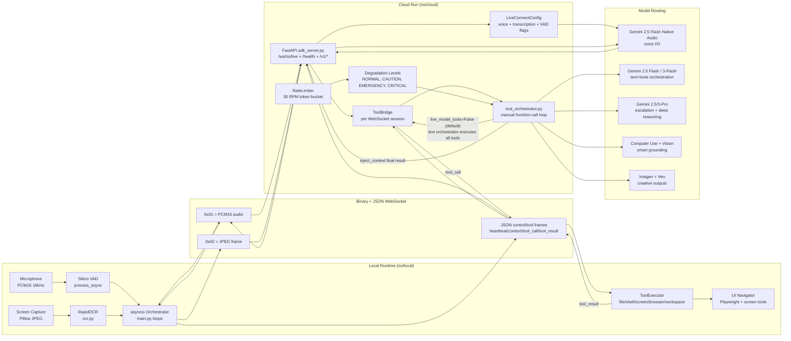

# Rio Agent


One command, full autonomy: Rio listens, sees the UI, plans, executes, and reports without requiring step-by-step human clicks.

## The Problem

Most assistants are still text boxes wrapped in better autocomplete. They do not maintain a continuous control loop over voice, screen context, and tool execution, so users end up acting as the orchestrator. For real tasks, that interaction model breaks: users must repeatedly restate context, approve micro-steps, and manually bridge the gap between intent and action.

## The Solution

Rio runs a live multimodal loop: voice-in, vision-in, actions-out. The local runtime streams audio and screenshots to a cloud relay, a tool orchestrator executes multi-step plans, and results are injected back into live voice output so users get completion, not partial progress.

## Challenge Categories Addressed

- ✅ Live Agent
- ✅ UI Navigator
- ✅ Storyteller / Creative Agent [In Progress] (media generation via Imagen + Veo exists; narrative packaging is still being productized)

## Architecture Diagram



## Innovation & Multimodal UX (Judge Criterion: 40%)

- Beyond Text
  - Evidence: Local runtime continuously supports mic audio, screenshot ingestion, and tool action execution (`local/main.py`, `local/screen_capture.py`, `cloud/adk_server.py`).
  - Outcome: User does not need to drive a text-only turn-by-turn loop.
- Barge-in / interruption handling
  - Evidence: F2 push-to-talk interrupt clears playback and can pause active tasks; VAD speech-start also clears playback (`local/main.py` audio loop).
  - Outcome: User can interrupt Rio in real time instead of waiting for turns.
- Distinct persona/voice
  - Evidence: Voice selection via `RIO_VOICE` and role/persona synthesis from config (`cloud/gemini_session.py`, `cloud/adk_server.py`, `cloud/voice_plugin.py`).
  - Outcome: Consistent agent identity (name/role/tagline) across sessions.
- Visual precision (UI Navigator)
  - Evidence: JPEG frame stream, OCR text grounding, smart coordinate confirmation and post-action verification (`local/screen_capture.py`, `local/ocr.py`, `local/tools.py`).
  - Outcome: Rio acts on actual on-screen context, not guesswork.
- Seamless/Live (not turn-based)
  - Evidence: bidirectional websocket + live audio session + background orchestrator task loop with context injection (`cloud/adk_server.py`, `cloud/tool_orchestrator.py`).
  - Outcome: User experiences one continuous execution lane.

## Technical Implementation (Judge Criterion: 30%)

- Google GenAI SDK + ADK usage
  - `genai.Client`, `client.aio.live.connect`, `types.LiveConnectConfig`, `types.SpeechConfig`, `types.AutomaticActivityDetection`, `types.FunctionDeclaration.from_callable` are used directly in cloud runtime.
  - ADK pattern is retained via `create_rio_agent(...)` in `cloud/rio_agent.py` for the per-session agent factory path.
- Cloud Run deployment
  - Container: Python 3.11 slim, non-root user, healthcheck, uvicorn startup (`cloud/Dockerfile`).
  - Runtime config: minScale=1, maxScale=5, session affinity, 3600s timeout (`cloud/service.yaml`) to reduce cold-start disruption for long live websocket sessions.
- ToolBridge pattern
  - One `ToolBridge` object is bound per websocket session and tool closures are created around it in `_make_tools(bridge)`.
  - Current source returns 58 closures (core + navigation + browser + workspace + memory + customer care + tutor + media).
  - Historical/core baseline commonly described as ~20 core closures; this build extends that set significantly.
- Error handling and fallbacks
  - Tool timeouts (`RIO_TOOLBRIDGE_TIMEOUT_SECONDS` plus per-tool overrides), command blocklist, schema validation, retry paths.
  - Degradation policy at 30 RPM with 4 levels (`cloud/rate_limiter.py`).
  - Live direct tools disabled by default (`RIO_LIVE_MODEL_TOOLS=false`), routing tool execution through text orchestrator.
  - Legacy mode and env-driven fallback knobs exist; `SESSION_MODE` and model overrides support non-live/text fallbacks.
- Grounding / anti-hallucination
  - Tool outputs are treated as execution truth and fed back into orchestrator loop.
  - OCR + screenshot context provide UI state evidence before/after actions.
  - Structured Pydantic validation is applied to incoming tool results in ToolBridge.
- Multi-tier auto-detection config system
  - Model and config values resolve by priority: env -> `.env`/yaml -> defaults (`local/config.py`, `cloud/adk_server.py`).
  - User-scoped runtime config overlays via `/api/users/{user_id}/config`.

## Demo Scenario

- T=0s: User says, "Rio, open Chrome, find yesterday's unread emails, and draft a summary."
- T=5s: Rio acknowledges verbally and starts task mode; orchestrator begins planning and tool routing.
- T=10s: Vision pipeline captures screen (JPEG) and OCR extracts visible context; browser/workspace actions execute.
- T=20s: Rio completes end-to-end flow, confirms outcome in voice, and dashboard shows tool trace + transcript.

Concrete observable sequence in demo:
1. Voice command accepted (live transcription event appears).
2. Browser/app action begins (tool_call stream visible).
3. Screen-grounded interactions occur (post-action screenshots auto-streamed).
4. Final spoken completion with concise result summary.

## Cloud Deployment Evidence

- Project ID: `rio-agent-45` (from `config.yaml` GCP section).
- Cloud Run service manifest: `cloud/service.yaml` (`name: rio-cloud`, region label `us-central1`).
- Verify live service once deployed:

```bash
curl -s https://<your-cloud-run-url>/health | jq
```

- Health endpoint expected fields include `status`, `service`, `backend`, `model` (`cloud/adk_server.py`).
- GCP services used:
  - Cloud Run
  - Gemini API (Live + content generation)
  - Vertex AI (optional/auto-configured path)
  - Secret Manager reference pattern in service manifest for `GEMINI_API_KEY`
  - Google Workspace APIs (Gmail/Drive/Calendar/Sheets/Docs)

## Quick Start

```bash
# curl install script — judges can run Rio locally
curl -sL https://raw.githubusercontent.com/Gowshik-S/Gemini-Live-Agent/main/install.sh | bash
```

Then configure local runtime:

1. Set required environment variables:
   - `GEMINI_API_KEY`
   - `GOOGLE_CLOUD_PROJECT` (required for Vertex AI / computer-use path)
   - `GOOGLE_CLOUD_LOCATION` (recommended: `global`)
2. Optional integrations:
   - `RIO_WORKSPACE_CLI_BIN` for workspace-cli binary path
   - `GOOGLE_APPLICATION_CREDENTIALS` and `GOOGLE_WORKSPACE_USER` for Workspace API impersonation
3. Start cloud relay:
   - `cd rio/cloud && uvicorn adk_server:app --host 0.0.0.0 --port 8080`
4. Start local runtime:
   - `cd rio/local && python main.py`

## Sub-Agent Breakdown

| Agent | Model | Role | Key Capability |
|-------|-------|------|----------------|
| Orchestrator | Gemini 2.5 Pro / 3-Pro escalation + Flash default | Planning + delegation | Multi-agent tool orchestration, looped function-calling |
| Live Agent | Gemini 2.5 Flash Native Audio | Voice I/O | Real-time streaming and barge-in support |
| UI Navigator | Gemini 2.5 Flash + Playwright | Screen control | OCR + screenshot-grounded UI actions |
| Creative Agent | Gemini + Imagen 3 + Veo 2 | Media generation | Interleaved image/video output |

## Known Limitations & Roadmap

- A2A protocol support (Agent Cards, remote discovery) is not yet implemented. [In Progress]
- `pyautogui` -> Playwright-centric control unification is still being expanded. [In Progress]
- React-first dashboard/frontend migration is planned; current dashboard is static HTML/JS. [In Progress]

## License + Contact

- License: see repository root license file.
- Contact: open an issue in the GitHub repository `Gowshik-S/Gemini-Live-Agent` for bug reports, deployment support, and collaboration.

#### Option 2: Manual Installation

```bash
cd Rio-Agent/rio

# Create and activate virtual environment
python -m venv .venv

# Windows:
.venv\Scripts\activate
# Linux/macOS:
source .venv/bin/activate

# Install dependencies
pip install -r requirements.txt

# For development (optional)
pip install -r requirements-dev.txt

# Configure API key
echo "GEMINI_API_KEY=your_api_key_here" > cloud/.env
```

### Running Rio

#### Start the Cloud Relay

**Windows:**
```cmd
cd Rio-Agent\rio\setup
run-cloud.bat
```

**Linux / macOS:**
```bash
cd Rio-Agent/rio/setup
./run-cloud.sh
```

The cloud relay will start on `http://localhost:8080`

#### Start the Local Client

**Windows:**
```cmd
cd Rio-Agent\rio\setup
run-local.bat
```

**Linux / macOS:**
```bash
cd Rio-Agent/rio/setup
./run-local.sh
```

### Verify Installation

After starting both services:

- **Health Check**: http://localhost:8080/health
- **Dashboard**: http://localhost:8080/dashboard
- **Setup Page**: http://localhost:8080/dashboard/setup.html

### Using the CLI

Rio includes a powerful CLI for configuration and diagnostics:

```bash
# Interactive setup wizard
python -m rio.cli configure

# Run system diagnostics
python -m rio.cli doctor

# Test API connectivity
python -m rio.cli doctor --test-api

# View configuration
python -m rio.cli config show

# Get a config value
python -m rio.cli config get models.primary

# Set a config value
python -m rio.cli config set models.primary gemini-3-flash-preview

# Start Rio
python -m rio.cli run
```

## Runtime Controls

### Hotkeys

Global hotkeys work when `pynput` is installed and your OS allows keyboard hooks.

| Key | Function | Description |
|-----|----------|-------------|
| **F2** | Push to Talk | Hold to speak, release to send |
| **F3** | Screenshot | Force an immediate screenshot |
| **F4** | Demo Trigger | Force proactive assistance (demo mode) |
| **F5** | Screen Mode | Toggle between on_demand and autonomous |
| **F6** | Live Mode | Toggle continuous monitoring and wake word |

### Screen Modes

- **on_demand**: Screenshots only when requested (F3, tool call, or user request)
- **autonomous**: Periodic screenshots based on `vision.fps` setting
- **Live Mode**: Continuous screen monitoring + wake word listening for hands-free operation

### Voice Commands

When in Live Mode or after pressing F2:

- **"Hey Rio"** - Wake word to activate listening
- **"Open [application]"** - Launch applications
- **"Click [description]"** - Smart click on UI elements
- **"Search for [query]"** - Web search
- **"Read file [path]"** - Read file contents
- **"Run [command]"** - Execute shell commands
- **"Take a screenshot"** - Capture screen
- **"Resume"** / **"Continue"** - Resume paused tasks

### CLI Commands

```bash
# Configuration
rio config show                          # View all settings
rio config get models.primary            # Get specific value
rio config set models.primary gemini-3-flash-preview  # Set value

# Diagnostics
rio doctor                               # Run system checks
rio doctor --test-api                    # Test API connectivity

# Setup
rio configure                            # Interactive setup wizard

# Execution
rio run                                  # Start Rio agent
```

## Configuration

Rio's behavior is controlled by `rio/config.yaml`. Here are the key settings:

### Core Settings

```yaml
rio:
  agent_name: Rio                    # Agent display name
  session_mode: live                 # "live" (audio) or "text"
  backend: direct                    # Connection mode
  cloud_url: ws://localhost:8080/ws/rio/live  # WebSocket endpoint
```

### Model Configuration

```yaml
  models:
    primary: gemini-3-flash-preview           # Main orchestrator model
    secondary: gemini-3-pro-preview           # Fallback model
    live: gemini-2.5-flash-native-audio-latest # Live audio model
    computer_use: gemini-3-flash-preview      # Vision grounding model
    imagen: imagen-4                          # Image generation
    timeout_seconds: 30.0
    cooldown_seconds: 60.0
    pro_rpm_budget: 5                         # Pro model rate limit
```

### Multi-Agent Configuration

```yaml
  agents:
    task_executor:
      enabled: true
      max_iterations: 25
      model: gemini-3-flash-preview
      tools: all
      description: "General task execution, multi-step workflows"
    
    code_agent:
      enabled: true
      max_iterations: 15
      model: gemini-3-flash-preview
      tools: dev
      description: "Coding, debugging, file editing, git operations"
    
    computer_use_agent:
      enabled: true
      max_iterations: 25
      model: gemini-3-flash-preview
      tools: screen
      description: "Screen interaction, GUI automation, browser navigation"
    
    research_agent:
      enabled: true
      max_iterations: 10
      model: gemini-2.5-pro
      tools: memory
      description: "Deep research, complex analysis, reasoning"
    
    creative_agent:
      enabled: true
      max_iterations: 5
      tools: creative
      description: "Image generation, video creation, design"
```

### Vision & Screen Capture

```yaml
  vision:
    default_mode: on_demand  # "on_demand" or "autonomous"
    fps: 0.33                # Screenshots per second in autonomous mode
    quality: 85              # JPEG quality (0-100)
    resize_factor: 0.75      # Scale factor for screenshots
```

### Audio Settings

```yaml
  audio:
    sample_rate: 16000
    block_size: 320
    latency: low
    use_wasapi: true         # Windows-specific audio API
    input_device: null       # Auto-detect
    output_device: null      # Auto-detect
```

### Hotkeys

```yaml
  hotkeys:
    push_to_talk: f2         # Voice input
    screenshot: f3           # Force screenshot
    toggle_proactive: f4     # Demo mode trigger
    screen_mode: f5          # Toggle screen capture mode
    live_mode: f6            # Toggle Live Mode
```

### Memory & Persistence

```yaml
  memory:
    db_path: ./data/memory
    max_recall: 5            # Number of memories to recall
```

### Struggle Detection

```yaml
  struggle:
    enabled: true
    threshold: 0.85          # Confidence threshold
    cooldown_seconds: 300    # Time between proactive offers
    decline_cooldown: 600    # Cooldown after user declines
    demo_mode: false         # Lower thresholds for demos
```

### Tool Policy & Rate Limiting

```yaml
  orchestrator:
    tool_timeout_seconds: 120
    heartbeat_interval_seconds: 5
    
    tool_policy:
      default_per_minute: 20
      max_calls_per_task: 120
      max_cost_points_per_task: 200
      
      cost_points:
        generate_video: 6
        gmail_send: 3
        run_command: 4
        start_process: 5
      
      per_tool_per_minute:
        gmail_send: 6
        run_command: 8
        smart_click: 30
```

### Filesystem Access Control

```yaml
  filesystem:
    enabled: true
    read_paths:
      - .                    # Current directory
    write_paths:
      - .                    # Current directory
```

### Skills

```yaml
  skills:
    customer_care:
      enabled: true
      default_priority: medium
      auto_escalate_after: 300
      ticket_dir: ./rio_tickets
    
    tutor:
      enabled: true
      default_difficulty: intermediate
      socratic_mode: true
      quiz_num_questions: 5
      progress_dir: ./rio_progress
```

### Logging

```yaml
  logging:
    log_dir: ./logs
    max_files: 7             # Days of logs to keep
    verbose: false
```

### Environment Variables

Set these in `rio/cloud/.env` or your environment:

```bash
# Required
GEMINI_API_KEY=your_api_key_here

# Optional overrides
SESSION_MODE=live                    # Override session mode
TEXT_MODEL=gemini-3-flash-preview    # Override text model
LIVE_MODEL=gemini-2.5-flash-native-audio-latest
RIO_WS_TOKEN=secret_token            # WebSocket authentication
PRO_RPM_BUDGET=5                     # Pro model rate limit
ORCHESTRATOR_MODEL=gemini-3-flash-preview
RIO_TOOLBRIDGE_TIMEOUT_SECONDS=60
RIO_ORCHESTRATOR_USE_AGENTS_MD=true  # Load agents.md instructions
```

## Available Tools

Rio provides 60+ tools organized by category:

### File Operations
- `read_file(path)` - Read file contents
- `write_file(path, content)` - Write to file (creates .rio.bak backup)
- `patch_file(path, old_text, new_text)` - Find and replace in file

### Shell & Process Management
- `run_command(command)` - Execute shell command (30s timeout, dangerous patterns blocked)
- `start_process(command, label)` - Start long-running background process
- `check_process(pid)` - Check process status
- `stop_process(pid)` - Stop background process
- `list_processes(name_filter)` - List running processes
- `kill_process(name_or_pid)` - Terminate process

### Screen Capture & Vision
- `capture_screen()` - Take screenshot
- `get_screen_info()` - Get monitor information

### Screen Automation (Coordinate-Based)
- `screen_click(x, y, button, clicks)` - Click at coordinates
- `screen_type(text, interval)` - Type text
- `screen_scroll(x, y, clicks)` - Scroll at position
- `screen_hotkey(keys)` - Press keyboard shortcut
- `screen_move(x, y)` - Move mouse cursor
- `screen_drag(start_x, start_y, end_x, end_y)` - Click and drag

### Vision-Guided Automation
- `smart_click(target, action, clicks)` - Click UI element by description (uses Computer Use model)

### Window Management
- `open_application(name_or_path)` - Launch application
- `list_all_windows()` - List all visible windows
- `get_active_window()` - Get foreground window info
- `find_window(title)` - Search for window by title
- `focus_window(title)` - Bring window to foreground
- `minimize_window(title)` - Minimize window
- `maximize_window(title)` - Maximize window
- `close_window(title)` - Close window
- `resize_window(title, width, height)` - Resize window
- `move_window(title, x, y)` - Move window

### Clipboard
- `get_clipboard()` - Read clipboard text
- `set_clipboard(text)` - Set clipboard text

### Browser Automation (Playwright)
- `browser_connect(cdp_url, browser, profile)` - Connect to browser via CDP
- `browser_navigate(url)` - Navigate to URL
- `browser_click_element(selector)` - Click element by CSS selector
- `browser_fill_form(selector, value)` - Fill form field
- `browser_extract_text(selector)` - Extract text from element
- `browser_evaluate(javascript)` - Execute JavaScript
- `browser_wait_for(selector, timeout)` - Wait for element

### Web Tools
- `web_search(query, max_results)` - Search web with DuckDuckGo
- `web_fetch(url, max_chars)` - Fetch and parse web page
- `web_cache_get(url)` - Get cached web page

### Memory & Notes
- `save_note(key, value, media_paths)` - Save persistent note
- `get_notes()` - Retrieve all notes
- `search_notes(query, limit)` - Search notes by keyword
- `export_context()` - Export session memory to file
- `memory_stats()` - Get memory system statistics

### Google Workspace
- `gmail_search(query, max_results)` - Search Gmail
- `gmail_send(to, subject, body, cc, bcc)` - Send email
- `drive_list(folder_id, max_results)` - List Drive files
- `calendar_list_events(calendar, time_min, time_max)` - List calendar events
- `sheets_read(spreadsheet_id, range_a1)` - Read from Sheets
- `docs_create(title, content)` - Create Google Doc

### Creative Tools
- `generate_image(prompt, aspect_ratio, style)` - Generate image with Imagen 3
- `generate_video(prompt, duration_seconds, aspect_ratio)` - Generate video with Veo 2

### Customer Care (Skill)
- `create_ticket(title, category, priority, description)` - Create support ticket
- `update_ticket(ticket_id, status, priority, notes)` - Update ticket

### Tutoring (Skill)
- `generate_quiz(topic, difficulty, num_questions)` - Generate quiz
- `track_progress(action, subject, topic, score)` - Track learning progress
- `explain_concept(concept, level, context)` - Get concept explanation

### Tool Risk Classification

Tools are classified by risk level for safety controls:

- **SAFE**: Read-only operations (read_file, capture_screen, list_windows)
- **MODERATE**: Writes and UI interactions (write_file, screen_click, generate_image)
- **DANGEROUS**: Shell execution and process control (run_command, kill_process)
- **CRITICAL**: Reserved for future destructive operations

## Safety Model

Rio is designed to degrade gracefully and avoid destructive behavior by default.

- Dangerous shell patterns such as `rm -rf`, `mkfs`, `shutdown`, `curl | bash`, and similar commands are blocked.
- `write_file` and `patch_file` create `.rio.bak` backups before modifying files.
- File paths are resolved relative to the tool working directory and blocked from escaping it.
- Dangerous tool calls are confirmed locally before execution.
- Screen actions are rate-limited and logged, and `pyautogui.FAILSAFE` stays enabled.

## Working Directory Scope

Rio's local file tools are scoped to the process working directory. The provided `run-local` scripts start the client from `rio/local`, so by default Rio can only read or modify files in that directory tree.

If you want Rio to operate on a different project, launch `rio/local/main.py` from that project's root so the tool executor resolves paths there.

## Skills and Persistence

### Customer Care

- Deterministic profile schema in `rio/local/profiles.py`
- Setup UI saves `customer_care_profile.json`
- Ticket tools persist JSON tickets under `rio_tickets/`

### Tutor

- Deterministic student profile schema in `rio/local/profiles.py`
- Setup UI saves `tutor_profile.json`
- Tutor tools persist progress under `rio_progress/`

### Local state generated by Rio

- `rio/rio_chats.db` - chat history
- `rio/rio_patterns.db` - user behavior and struggle patterns
- `rio/rio_memory/` - optional vector memory store
- `rio/rio_profiles/` - saved customer care and tutor profiles
- `rio/local/*.rio.bak` or project-local `.rio.bak` files - backups from edits

## Testing

Rio includes a smoke/integration-style test script at [`rio/tests/test_all.py`](rio/tests/test_all.py).

Run it with:

```bash
cd Rio-Agent
python rio/tests/test_all.py
```

The suite validates imports, config loading, rate limiting, model routing, tool execution, dashboard files, and wire protocol constants. Optional features may be skipped if their dependencies are not installed.

## Cloud Run Deployment

The repo includes a deploy script and container spec:

- [`rio/deploy.sh`](rio/deploy.sh)
- [`rio/cloud/service.yaml`](rio/cloud/service.yaml)
- [`rio/cloud/Dockerfile`](rio/cloud/Dockerfile)

Deployment assumptions:

1. `gcloud` is installed and authenticated.
2. Cloud Run, Cloud Build, and Secret Manager are enabled.
3. A secret named `gemini-api-key` exists in Secret Manager.

Then run:

```bash
cd Rio-Agent/rio
chmod +x deploy.sh
./deploy.sh
```

The script prints the HTTP URL and the WebSocket URL to put back into `rio/config.yaml`.

## Known Limitations

- Gemini Pro routing is not complete yet. The router can decide that Pro should be used, but the actual Pro call path still returns `None`.
- The checked-in model settings and the cloud runtime are not perfectly aligned. `cloud/gemini_session.py` defaults to `gemini-2.5-flash` and `gemini-2.5-flash-native-audio-latest`, regardless of the older model notes elsewhere in the repo.
- Memory, some hotkeys, and some screen-navigation features are optional and may appear disabled until their dependencies are installed.
- Desktop automation on Wayland and elevated/admin windows is inherently less reliable than standard Windows desktop automation.
- The codebase contains version strings from multiple milestones (`v0.6.x`, `v0.7.x`, `v0.9.0`) because the project evolved layer by layer.

## Tech Stack

| Layer | Tech |
| --- | --- |
| Cloud relay | FastAPI, uvicorn, websockets, structlog |
| Gemini integration | `google-genai`, Gemini 2.5 Flash text mode, Gemini Live audio mode |
| Audio | `sounddevice`, CPU PyTorch, Silero VAD |
| Vision | `mss`, Pillow, RapidOCR |
| Desktop automation | `pyautogui`, `pygetwindow`, `pyperclip` |
| Memory and local state | SQLite, optional ChromaDB, sentence-transformers |
| ML | NumPy, scikit-learn ensemble pipeline |
| UI | Static HTML/CSS/JS dashboard served by FastAPI |

## Related Docs

- [`Rio-Plan.md`](Rio-Plan.md) - architecture and hackathon plan
- [`context.txt`](context.txt) - project-wide context snapshot
- [`rio/setup/README.md`](rio/setup/README.md) - setup-script-focused quick reference
